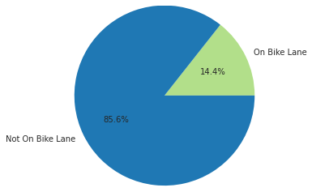
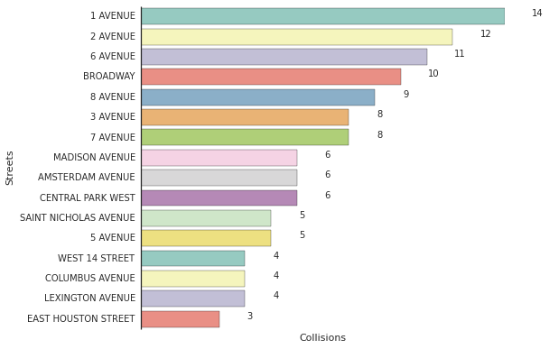
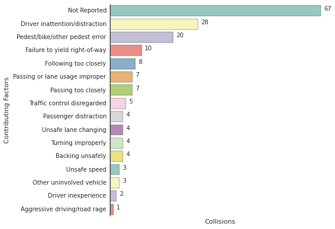
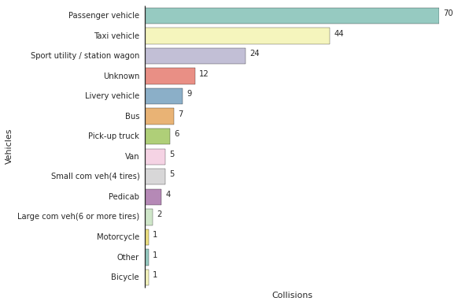

# Bikeccident
*A Look Into NYPD Manhattan Bike Collision Data*

#### Intro

My first summer interning in Tech I spent the leftovers of my first real paycheck on my first real bike: a sporty commuter that would replace the fifty pound, flat-tired mountain bike I had been sweating on for the past forever. My commutes became fast and my joyrides long. Now the bike and I go everywhere. 

Everywhere I bike to in New York City, however, there's this looming fear of every mile bringing me one closer to a crash. The white bicycles tied to posts, the concerned texts from mom, the close calls with cabs- all these don't help. This Notebook looks a little bit into NYPD's motor vehicle collision data (which you can find in its original form at  http://www.nyc.gov/html/nypd/html/traffic_reports/motor_vehicle_collision_data.shtml). With it I'll try to visualize where collisions are happening, the most common reason for them to happen, and if it's worth it to ride in a bike lane. 

I pull the data from the most recent month (currently July 2015) for Manhattan. My future changes will be to look for the entire year over all five boroughs. It is my understanding that the collisions only represent those reported to/by the police; any accidents that occur unreported won't appear. For this reason the raw number of collisions isn't super relevant on its own - only in relation to time, location or contributing factor can we see something useful. 

Most of this project was just an excuse to play with Python and some of its visualization libraries, but I hope it's of some interest to you with or without a coding background!


```python
import CollisionDataFetcher
import CollisionMapper
import CollisionPlotter
import FoliumUtilities

collisions = CollisionDataFetcher.fetchData()
```

#### Collision Mapping

The NYPD Collision data gives the locations of collisions as street intersections. Below you can see them displayed as blue circles. If the collision resulted in cyclist death, the circle will be purple (there are none on the map for July 2015).  If the NYPD reported a contributing factor it will appear when you click the collision. 


```python
map = CollisionMapper.create_collision_map(collisions)
FoliumUtilities.inline_map(map)
```

    Number of Collisions At Time of Mapping: 
    177


<iframe srcdoc="<!DOCTYPE html>
<head>
   <meta http-equiv=&quot;content-type&quot; content=&quot;text/html; charset=UTF-8&quot; />
   <link rel=&quot;stylesheet&quot; href=&quot;https://cdnjs.cloudflare.com/ajax/libs/leaflet/0.7.3/leaflet.css&quot; />
   <script src=&quot;https://cdnjs.cloudflare.com/ajax/libs/leaflet/0.7.3/leaflet.js&quot;></script>

   <script src=&quot;https://ajax.googleapis.com/ajax/libs/jquery/1.11.1/jquery.min.js&quot;></script>

   <link rel=&quot;stylesheet&quot; href=&quot;https://maxcdn.bootstrapcdn.com/bootstrap/3.2.0/css/bootstrap.min.css&quot;>
   <link rel=&quot;stylesheet&quot; href=&quot;https://maxcdn.bootstrapcdn.com/bootstrap/3.2.0/css/bootstrap-theme.min.css&quot;>
   <script src=&quot;https://maxcdn.bootstrapcdn.com/bootstrap/3.2.0/js/bootstrap.min.js&quot;></script>

   <link href=&quot;https://maxcdn.bootstrapcdn.com/font-awesome/4.1.0/css/font-awesome.min.css&quot; rel=&quot;stylesheet&quot;>

   <link rel=&quot;stylesheet&quot; href=&quot;https://rawgit.com/lvoogdt/Leaflet.awesome-markers/2.0/develop/dist/leaflet.awesome-markers.css&quot;>
   <script src=&quot;https://rawgithub.com/lvoogdt/Leaflet.awesome-markers/2.0/develop/dist/leaflet.awesome-markers.js&quot;></script>


   <link rel=&quot;stylesheet&quot; href=&quot;https://cdnjs.cloudflare.com/ajax/libs/leaflet.markercluster/0.4.0/MarkerCluster.Default.css&quot;>
   <link rel=&quot;stylesheet&quot; href=&quot;https://cdnjs.cloudflare.com/ajax/libs/leaflet.markercluster/0.4.0/MarkerCluster.css&quot;>
   <script src=&quot;https://cdnjs.cloudflare.com/ajax/libs/leaflet.markercluster/0.4.0/leaflet.markercluster-src.js&quot;></script>
   <script src=&quot;https://cdnjs.cloudflare.com/ajax/libs/leaflet.markercluster/0.4.0/leaflet.markercluster.js&quot;></script>

   <link rel=&quot;stylesheet&quot; href=&quot;https://birdage.github.io/Leaflet.awesome-markers/dist/leaflet.awesome.rotate.css&quot;>

   
   
   
   

   <style>

      html, body {
        width: 100%;
        height: 100%;
        margin: 0;
        padding: 0;
      }

      #map {
        position:absolute;
        top:0;
        bottom:0;
        right:0;
        left:0;
      }

   </style>
</head>

<body>

   <div class=&quot;folium-map&quot; id=&quot;folium_2017b21c4cdc4ffd80711db9476a16ee&quot; style=&quot;width: 100%; height: 100%&quot;></div>

   <script>

      

      var base_tile = L.tileLayer('https://{s}.tile.openstreetmap.org/{z}/{x}/{y}.png', {
          maxZoom: 18,
          minZoom: 1,
          attribution: 'Map data (c) <a href=&quot;http://openstreetmap.org&quot;>OpenStreetMap</a> contributors'
      });

      var baseLayer = {
        &quot;Base Layer&quot;: base_tile
      };

      /*
      addition of the wms layers
      */

      

      /*
      addition of the tile layers
      */
      

      /*
      list of layers to be added
      */
      var layer_list = {
      
      };

      /*
      Bounding box.
      */
      var southWest = L.latLng(-90, -180),
          northEast = L.latLng(90, 180),
          bounds = L.latLngBounds(southWest, northEast);

      /*
      Creates the map and adds the selected layers
      */
      var map = L.map('folium_2017b21c4cdc4ffd80711db9476a16ee', {
                                       center:[40.7902778, -73.9597222],
                                       zoom: 12,
                                       maxBounds: bounds,
                                       layers: [base_tile]
                                     });

      L.control.layers(baseLayer, layer_list).addTo(map);

      //cluster group
      var clusteredmarkers = L.markerClusterGroup();
      //section for adding clustered markers
      
      //add the clustered markers to the group anyway
      map.addLayer(clusteredmarkers);

      

      
      var circle_1 = L.circle([40.7100794231, -74.0163829821], 30, {
                            color: '#003e61',
                            fillColor: '#003e61',
                            fillOpacity: 0.2
                            });
      circle_1.bindPopup(&quot;Driver inattention/distraction&quot;);
      circle_1._popup.options.maxWidth = 300;
      map.addLayer(circle_1)
      
      var circle_2 = L.circle([40.7017826251, -74.011165874], 30, {
                            color: '#003e61',
                            fillColor: '#003e61',
                            fillOpacity: 0.2
                            });
      circle_2.bindPopup(&quot;Driver inattention/distraction&quot;);
      circle_2._popup.options.maxWidth = 300;
      map.addLayer(circle_2)
      
      var circle_3 = L.circle([40.7233075503, -74.0029799712], 30, {
                            color: '#003e61',
                            fillColor: '#003e61',
                            fillOpacity: 0.2
                            });
      circle_3.bindPopup(&quot;Traffic control disregarded&quot;);
      circle_3._popup.options.maxWidth = 300;
      map.addLayer(circle_3)
      
      var circle_4 = L.circle([40.7149275646, -74.0079395786], 30, {
                            color: '#003e61',
                            fillColor: '#003e61',
                            fillOpacity: 0.2
                            });
      
      map.addLayer(circle_4)
      
      var circle_5 = L.circle([40.7271556049, -74.0055453755], 30, {
                            color: '#003e61',
                            fillColor: '#003e61',
                            fillOpacity: 0.2
                            });
      circle_5.bindPopup(&quot;Passing too closely&quot;);
      circle_5._popup.options.maxWidth = 300;
      map.addLayer(circle_5)
      
      var circle_6 = L.circle([40.7176779433, -74.0057790685], 30, {
                            color: '#003e61',
                            fillColor: '#003e61',
                            fillOpacity: 0.2
                            });
      circle_6.bindPopup(&quot;Failure to yield right-of-way&quot;);
      circle_6._popup.options.maxWidth = 300;
      map.addLayer(circle_6)
      
      var circle_7 = L.circle([40.7190580302, -74.0124422098], 30, {
                            color: '#003e61',
                            fillColor: '#003e61',
                            fillOpacity: 0.2
                            });
      circle_7.bindPopup(&quot;Failure to yield right-of-way&quot;);
      circle_7._popup.options.maxWidth = 300;
      map.addLayer(circle_7)
      
      var circle_8 = L.circle([40.7109058546, -74.0144570247], 30, {
                            color: '#003e61',
                            fillColor: '#003e61',
                            fillOpacity: 0.2
                            });
      circle_8.bindPopup(&quot;Pedest/bike/other pedest error&quot;);
      circle_8._popup.options.maxWidth = 300;
      map.addLayer(circle_8)
      
      var circle_9 = L.circle([40.706141696, -74.006019723], 30, {
                            color: '#003e61',
                            fillColor: '#003e61',
                            fillOpacity: 0.2
                            });
      circle_9.bindPopup(&quot;Driver inattention/distraction&quot;);
      circle_9._popup.options.maxWidth = 300;
      map.addLayer(circle_9)
      
      var circle_10 = L.circle([40.7150375845, -73.9968075699], 30, {
                            color: '#003e61',
                            fillColor: '#003e61',
                            fillOpacity: 0.2
                            });
      circle_10.bindPopup(&quot;Pedest/bike/other pedest error&quot;);
      circle_10._popup.options.maxWidth = 300;
      map.addLayer(circle_10)
      
      var circle_11 = L.circle([40.7120705012, -73.9969483891], 30, {
                            color: '#003e61',
                            fillColor: '#003e61',
                            fillOpacity: 0.2
                            });
      
      map.addLayer(circle_11)
      
      var circle_12 = L.circle([40.7236503338, -73.9910239631], 30, {
                            color: '#003e61',
                            fillColor: '#003e61',
                            fillOpacity: 0.2
                            });
      circle_12.bindPopup(&quot;Driver inattention/distraction&quot;);
      circle_12._popup.options.maxWidth = 300;
      map.addLayer(circle_12)
      
      var circle_13 = L.circle([40.7212487585, -73.9922364408], 30, {
                            color: '#003e61',
                            fillColor: '#003e61',
                            fillOpacity: 0.2
                            });
      circle_13.bindPopup(&quot;Driver inattention/distraction&quot;);
      circle_13._popup.options.maxWidth = 300;
      map.addLayer(circle_13)
      
      var circle_14 = L.circle([40.71017665, -74.0011362058], 30, {
                            color: '#003e61',
                            fillColor: '#003e61',
                            fillOpacity: 0.2
                            });
      
      map.addLayer(circle_14)
      
      var circle_15 = L.circle([40.7328482887, -73.9959154838], 30, {
                            color: '#003e61',
                            fillColor: '#003e61',
                            fillOpacity: 0.2
                            });
      circle_15.bindPopup(&quot;Failure to yield right-of-way&quot;);
      circle_15._popup.options.maxWidth = 300;
      map.addLayer(circle_15)
      
      var circle_16 = L.circle([40.7322526917, -73.9963521122], 30, {
                            color: '#003e61',
                            fillColor: '#003e61',
                            fillOpacity: 0.2
                            });
      circle_16.bindPopup(&quot;Pedest/bike/other pedest error&quot;);
      circle_16._popup.options.maxWidth = 300;
      map.addLayer(circle_16)
      
      var circle_17 = L.circle([40.7296534453, -74.0022045227], 30, {
                            color: '#003e61',
                            fillColor: '#003e61',
                            fillOpacity: 0.2
                            });
      circle_17.bindPopup(&quot;Passenger distraction&quot;);
      circle_17._popup.options.maxWidth = 300;
      map.addLayer(circle_17)
      
      var circle_18 = L.circle([40.7397513873, -74.002522414], 30, {
                            color: '#003e61',
                            fillColor: '#003e61',
                            fillOpacity: 0.2
                            });
      
      map.addLayer(circle_18)
      
      var circle_19 = L.circle([40.7397513873, -74.002522414], 30, {
                            color: '#003e61',
                            fillColor: '#003e61',
                            fillOpacity: 0.2
                            });
      circle_19.bindPopup(&quot;Passing or lane usage improper&quot;);
      circle_19._popup.options.maxWidth = 300;
      map.addLayer(circle_19)
      
      var circle_20 = L.circle([40.7316706709, -74.0066245929], 30, {
                            color: '#003e61',
                            fillColor: '#003e61',
                            fillOpacity: 0.2
                            });
      circle_20.bindPopup(&quot;Following too closely&quot;);
      circle_20._popup.options.maxWidth = 300;
      map.addLayer(circle_20)
      
      var circle_21 = L.circle([40.7291676385, -74.0011906501], 30, {
                            color: '#003e61',
                            fillColor: '#003e61',
                            fillOpacity: 0.2
                            });
      circle_21.bindPopup(&quot;Backing unsafely&quot;);
      circle_21._popup.options.maxWidth = 300;
      map.addLayer(circle_21)
      
      var circle_22 = L.circle([40.7311655432, -73.9919213774], 30, {
                            color: '#003e61',
                            fillColor: '#003e61',
                            fillOpacity: 0.2
                            });
      circle_22.bindPopup(&quot;Unsafe speed&quot;);
      circle_22._popup.options.maxWidth = 300;
      map.addLayer(circle_22)
      
      var circle_23 = L.circle([40.7330540394, -74.006408236], 30, {
                            color: '#003e61',
                            fillColor: '#003e61',
                            fillOpacity: 0.2
                            });
      circle_23.bindPopup(&quot;Unsafe lane changing&quot;);
      circle_23._popup.options.maxWidth = 300;
      map.addLayer(circle_23)
      
      var circle_24 = L.circle([40.7229337414, -73.9886393745], 30, {
                            color: '#003e61',
                            fillColor: '#003e61',
                            fillOpacity: 0.2
                            });
      
      map.addLayer(circle_24)
      
      var circle_25 = L.circle([40.7171558543, -73.9870386825], 30, {
                            color: '#003e61',
                            fillColor: '#003e61',
                            fillOpacity: 0.2
                            });
      circle_25.bindPopup(&quot;Unsafe speed&quot;);
      circle_25._popup.options.maxWidth = 300;
      map.addLayer(circle_25)
      
      var circle_26 = L.circle([40.7177238692, -73.9857651559], 30, {
                            color: '#003e61',
                            fillColor: '#003e61',
                            fillOpacity: 0.2
                            });
      
      map.addLayer(circle_26)
      
      var circle_27 = L.circle([40.7185558068, -73.9882000111], 30, {
                            color: '#003e61',
                            fillColor: '#003e61',
                            fillOpacity: 0.2
                            });
      circle_27.bindPopup(&quot;Following too closely&quot;);
      circle_27._popup.options.maxWidth = 300;
      map.addLayer(circle_27)
      
      var circle_28 = L.circle([40.7180039331, -73.9865839818], 30, {
                            color: '#003e61',
                            fillColor: '#003e61',
                            fillOpacity: 0.2
                            });
      circle_28.bindPopup(&quot;Traffic control disregarded&quot;);
      circle_28._popup.options.maxWidth = 300;
      map.addLayer(circle_28)
      
      var circle_29 = L.circle([40.7222418062, -73.986287301], 30, {
                            color: '#003e61',
                            fillColor: '#003e61',
                            fillOpacity: 0.2
                            });
      circle_29.bindPopup(&quot;Turning improperly&quot;);
      circle_29._popup.options.maxWidth = 300;
      map.addLayer(circle_29)
      
      var circle_30 = L.circle([40.7127698797, -73.9884823925], 30, {
                            color: '#003e61',
                            fillColor: '#003e61',
                            fillOpacity: 0.2
                            });
      circle_30.bindPopup(&quot;Pedest/bike/other pedest error&quot;);
      circle_30._popup.options.maxWidth = 300;
      map.addLayer(circle_30)
      
      var circle_31 = L.circle([40.7100938598, -73.9897885883], 30, {
                            color: '#003e61',
                            fillColor: '#003e61',
                            fillOpacity: 0.2
                            });
      circle_31.bindPopup(&quot;Driver inexperience&quot;);
      circle_31._popup.options.maxWidth = 300;
      map.addLayer(circle_31)
      
      var circle_32 = L.circle([40.732347831, -73.9849393616], 30, {
                            color: '#003e61',
                            fillColor: '#003e61',
                            fillOpacity: 0.2
                            });
      
      map.addLayer(circle_32)
      
      var circle_33 = L.circle([40.7279758077, -73.9881189678], 30, {
                            color: '#003e61',
                            fillColor: '#003e61',
                            fillOpacity: 0.2
                            });
      circle_33.bindPopup(&quot;Passenger distraction&quot;);
      circle_33._popup.options.maxWidth = 300;
      map.addLayer(circle_33)
      
      var circle_34 = L.circle([40.7285960755, -73.9876714653], 30, {
                            color: '#003e61',
                            fillColor: '#003e61',
                            fillOpacity: 0.2
                            });
      circle_34.bindPopup(&quot;Turning improperly&quot;);
      circle_34._popup.options.maxWidth = 300;
      map.addLayer(circle_34)
      
      var circle_35 = L.circle([40.7230102736, -73.9857532037], 30, {
                            color: '#003e61',
                            fillColor: '#003e61',
                            fillOpacity: 0.2
                            });
      circle_35.bindPopup(&quot;Failure to yield right-of-way&quot;);
      circle_35._popup.options.maxWidth = 300;
      map.addLayer(circle_35)
      
      var circle_36 = L.circle([40.7226722895, -73.9829645401], 30, {
                            color: '#003e61',
                            fillColor: '#003e61',
                            fillOpacity: 0.2
                            });
      circle_36.bindPopup(&quot;Other uninvolved vehicle&quot;);
      circle_36._popup.options.maxWidth = 300;
      map.addLayer(circle_36)
      
      var circle_37 = L.circle([40.7262812263, -73.9803334771], 30, {
                            color: '#003e61',
                            fillColor: '#003e61',
                            fillOpacity: 0.2
                            });
      
      map.addLayer(circle_37)
      
      var circle_38 = L.circle([40.7278664263, -73.9931448758], 30, {
                            color: '#003e61',
                            fillColor: '#003e61',
                            fillOpacity: 0.2
                            });
      circle_38.bindPopup(&quot;Driver inattention/distraction&quot;);
      circle_38._popup.options.maxWidth = 300;
      map.addLayer(circle_38)
      
      var circle_39 = L.circle([40.7422546259, -74.0007037042], 30, {
                            color: '#003e61',
                            fillColor: '#003e61',
                            fillOpacity: 0.2
                            });
      circle_39.bindPopup(&quot;Driver inattention/distraction&quot;);
      circle_39._popup.options.maxWidth = 300;
      map.addLayer(circle_39)
      
      var circle_40 = L.circle([40.7428392596, -74.0002742666], 30, {
                            color: '#003e61',
                            fillColor: '#003e61',
                            fillOpacity: 0.2
                            });
      circle_40.bindPopup(&quot;Traffic control disregarded&quot;);
      circle_40._popup.options.maxWidth = 300;
      map.addLayer(circle_40)
      
      var circle_41 = L.circle([40.7544905189, -74.0067387538], 30, {
                            color: '#003e61',
                            fillColor: '#003e61',
                            fillOpacity: 0.2
                            });
      circle_41.bindPopup(&quot;Backing unsafely&quot;);
      circle_41._popup.options.maxWidth = 300;
      map.addLayer(circle_41)
      
      var circle_42 = L.circle([40.7570212659, -74.0049270211], 30, {
                            color: '#003e61',
                            fillColor: '#003e61',
                            fillOpacity: 0.2
                            });
      
      map.addLayer(circle_42)
      
      var circle_43 = L.circle([40.7332118553, -73.9810566898], 30, {
                            color: '#003e61',
                            fillColor: '#003e61',
                            fillOpacity: 0.2
                            });
      
      map.addLayer(circle_43)
      
      var circle_44 = L.circle([40.737553522, -73.9780531961], 30, {
                            color: '#003e61',
                            fillColor: '#003e61',
                            fillOpacity: 0.2
                            });
      circle_44.bindPopup(&quot;Driver inattention/distraction&quot;);
      circle_44._popup.options.maxWidth = 300;
      map.addLayer(circle_44)
      
      var circle_45 = L.circle([40.7372219947, -73.9813911371], 30, {
                            color: '#003e61',
                            fillColor: '#003e61',
                            fillOpacity: 0.2
                            });
      
      map.addLayer(circle_45)
      
      var circle_46 = L.circle([40.7363771289, -73.9849348425], 30, {
                            color: '#003e61',
                            fillColor: '#003e61',
                            fillOpacity: 0.2
                            });
      
      map.addLayer(circle_46)
      
      var circle_47 = L.circle([40.7415487552, -73.9895744627], 30, {
                            color: '#003e61',
                            fillColor: '#003e61',
                            fillOpacity: 0.2
                            });
      circle_47.bindPopup(&quot;Passing or lane usage improper&quot;);
      circle_47._popup.options.maxWidth = 300;
      map.addLayer(circle_47)
      
      var circle_48 = L.circle([40.7440655116, -73.9877479971], 30, {
                            color: '#003e61',
                            fillColor: '#003e61',
                            fillOpacity: 0.2
                            });
      circle_48.bindPopup(&quot;Pedest/bike/other pedest error&quot;);
      circle_48._popup.options.maxWidth = 300;
      map.addLayer(circle_48)
      
      var circle_49 = L.circle([40.7373606924, -73.9968389766], 30, {
                            color: '#003e61',
                            fillColor: '#003e61',
                            fillOpacity: 0.2
                            });
      
      map.addLayer(circle_49)
      
      var circle_50 = L.circle([40.7392682486, -73.9954459752], 30, {
                            color: '#003e61',
                            fillColor: '#003e61',
                            fillOpacity: 0.2
                            });
      circle_50.bindPopup(&quot;Driver inattention/distraction&quot;);
      circle_50._popup.options.maxWidth = 300;
      map.addLayer(circle_50)
      
      var circle_51 = L.circle([40.7404429654, -73.9945942556], 30, {
                            color: '#003e61',
                            fillColor: '#003e61',
                            fillOpacity: 0.2
                            });
      circle_51.bindPopup(&quot;Failure to yield right-of-way&quot;);
      circle_51._popup.options.maxWidth = 300;
      map.addLayer(circle_51)
      
      var circle_52 = L.circle([40.7410275763, -73.9941611674], 30, {
                            color: '#003e61',
                            fillColor: '#003e61',
                            fillOpacity: 0.2
                            });
      
      map.addLayer(circle_52)
      
      var circle_53 = L.circle([40.7429103986, -73.9928041031], 30, {
                            color: '#003e61',
                            fillColor: '#003e61',
                            fillOpacity: 0.2
                            });
      circle_53.bindPopup(&quot;Passenger distraction&quot;);
      circle_53._popup.options.maxWidth = 300;
      map.addLayer(circle_53)
      
      var circle_54 = L.circle([40.7440990179, -73.9956441311], 30, {
                            color: '#003e61',
                            fillColor: '#003e61',
                            fillOpacity: 0.2
                            });
      
      map.addLayer(circle_54)
      
      var circle_55 = L.circle([40.7325930005, -73.9744105316], 30, {
                            color: '#003e61',
                            fillColor: '#003e61',
                            fillOpacity: 0.2
                            });
      
      map.addLayer(circle_55)
      
      var circle_56 = L.circle([40.7339649293, -73.9887782171], 30, {
                            color: '#003e61',
                            fillColor: '#003e61',
                            fillOpacity: 0.2
                            });
      circle_56.bindPopup(&quot;Pedest/bike/other pedest error&quot;);
      circle_56._popup.options.maxWidth = 300;
      map.addLayer(circle_56)
      
      var circle_57 = L.circle([40.7359878767, -73.9894562556], 30, {
                            color: '#003e61',
                            fillColor: '#003e61',
                            fillOpacity: 0.2
                            });
      circle_57.bindPopup(&quot;Other uninvolved vehicle&quot;);
      circle_57._popup.options.maxWidth = 300;
      map.addLayer(circle_57)
      
      var circle_58 = L.circle([40.7364652084, -73.9869627578], 30, {
                            color: '#003e61',
                            fillColor: '#003e61',
                            fillOpacity: 0.2
                            });
      circle_58.bindPopup(&quot;Driver inattention/distraction&quot;);
      circle_58._popup.options.maxWidth = 300;
      map.addLayer(circle_58)
      
      var circle_59 = L.circle([40.7401842783, -73.986362998], 30, {
                            color: '#003e61',
                            fillColor: '#003e61',
                            fillOpacity: 0.2
                            });
      
      map.addLayer(circle_59)
      
      var circle_60 = L.circle([40.742772606, -73.9865970381], 30, {
                            color: '#003e61',
                            fillColor: '#003e61',
                            fillOpacity: 0.2
                            });
      circle_60.bindPopup(&quot;Other uninvolved vehicle&quot;);
      circle_60._popup.options.maxWidth = 300;
      map.addLayer(circle_60)
      
      var circle_61 = L.circle([40.7420255461, -73.9829126782], 30, {
                            color: '#003e61',
                            fillColor: '#003e61',
                            fillOpacity: 0.2
                            });
      circle_61.bindPopup(&quot;Pedest/bike/other pedest error&quot;);
      circle_61._popup.options.maxWidth = 300;
      map.addLayer(circle_61)
      
      var circle_62 = L.circle([40.7465355809, -73.9859502752], 30, {
                            color: '#003e61',
                            fillColor: '#003e61',
                            fillOpacity: 0.2
                            });
      circle_62.bindPopup(&quot;Driver inattention/distraction&quot;);
      circle_62._popup.options.maxWidth = 300;
      map.addLayer(circle_62)
      
      var circle_63 = L.circle([40.7410275763, -73.9941611674], 30, {
                            color: '#003e61',
                            fillColor: '#003e61',
                            fillOpacity: 0.2
                            });
      circle_63.bindPopup(&quot;Pedest/bike/other pedest error&quot;);
      circle_63._popup.options.maxWidth = 300;
      map.addLayer(circle_63)
      
      var circle_64 = L.circle([40.7491025003, -73.9920058208], 30, {
                            color: '#003e61',
                            fillColor: '#003e61',
                            fillOpacity: 0.2
                            });
      circle_64.bindPopup(&quot;Unsafe lane changing&quot;);
      circle_64._popup.options.maxWidth = 300;
      map.addLayer(circle_64)
      
      var circle_65 = L.circle([40.756710419, -73.9864570718], 30, {
                            color: '#003e61',
                            fillColor: '#003e61',
                            fillOpacity: 0.2
                            });
      circle_65.bindPopup(&quot;Passenger distraction&quot;);
      circle_65._popup.options.maxWidth = 300;
      map.addLayer(circle_65)
      
      var circle_66 = L.circle([40.7579728897, -73.9855363694], 30, {
                            color: '#003e61',
                            fillColor: '#003e61',
                            fillOpacity: 0.2
                            });
      circle_66.bindPopup(&quot;Driver inexperience&quot;);
      circle_66._popup.options.maxWidth = 300;
      map.addLayer(circle_66)
      
      var circle_67 = L.circle([40.7502938828, -73.9948424892], 30, {
                            color: '#003e61',
                            fillColor: '#003e61',
                            fillOpacity: 0.2
                            });
      
      map.addLayer(circle_67)
      
      var circle_68 = L.circle([40.7585331852, -73.9888426608], 30, {
                            color: '#003e61',
                            fillColor: '#003e61',
                            fillOpacity: 0.2
                            });
      
      map.addLayer(circle_68)
      
      var circle_69 = L.circle([40.7597301337, -73.9916832833], 30, {
                            color: '#003e61',
                            fillColor: '#003e61',
                            fillOpacity: 0.2
                            });
      circle_69.bindPopup(&quot;Driver inattention/distraction&quot;);
      circle_69._popup.options.maxWidth = 300;
      map.addLayer(circle_69)
      
      var circle_70 = L.circle([40.7528008346, -73.9792861663], 30, {
                            color: '#003e61',
                            fillColor: '#003e61',
                            fillOpacity: 0.2
                            });
      
      map.addLayer(circle_70)
      
      var circle_71 = L.circle([40.7430998233, -73.9740095297], 30, {
                            color: '#003e61',
                            fillColor: '#003e61',
                            fillOpacity: 0.2
                            });
      
      map.addLayer(circle_71)
      
      var circle_72 = L.circle([40.746919854, -73.9712291154], 30, {
                            color: '#003e61',
                            fillColor: '#003e61',
                            fillOpacity: 0.2
                            });
      circle_72.bindPopup(&quot;Pedest/bike/other pedest error&quot;);
      circle_72._popup.options.maxWidth = 300;
      map.addLayer(circle_72)
      
      var circle_73 = L.circle([40.750111393, -73.9689070439], 30, {
                            color: '#003e61',
                            fillColor: '#003e61',
                            fillOpacity: 0.2
                            });
      
      map.addLayer(circle_73)
      
      var circle_74 = L.circle([40.7518951155, -73.9675888308], 30, {
                            color: '#003e61',
                            fillColor: '#003e61',
                            fillOpacity: 0.2
                            });
      
      map.addLayer(circle_74)
      
      var circle_75 = L.circle([40.7536248099, -73.9694323698], 30, {
                            color: '#003e61',
                            fillColor: '#003e61',
                            fillOpacity: 0.2
                            });
      
      map.addLayer(circle_75)
      
      var circle_76 = L.circle([40.7561330082, -73.9676048162], 30, {
                            color: '#003e61',
                            fillColor: '#003e61',
                            fillOpacity: 0.2
                            });
      circle_76.bindPopup(&quot;Failure to yield right-of-way&quot;);
      circle_76._popup.options.maxWidth = 300;
      map.addLayer(circle_76)
      
      var circle_77 = L.circle([40.7599830627, -73.9648018164], 30, {
                            color: '#003e61',
                            fillColor: '#003e61',
                            fillOpacity: 0.2
                            });
      circle_77.bindPopup(&quot;Unsafe lane changing&quot;);
      circle_77._popup.options.maxWidth = 300;
      map.addLayer(circle_77)
      
      var circle_78 = L.circle([40.7507660043, -73.974443252], 30, {
                            color: '#003e61',
                            fillColor: '#003e61',
                            fillOpacity: 0.2
                            });
      circle_78.bindPopup(&quot;Failure to yield right-of-way&quot;);
      circle_78._popup.options.maxWidth = 300;
      map.addLayer(circle_78)
      
      var circle_79 = L.circle([40.7533181923, -73.9725870727], 30, {
                            color: '#003e61',
                            fillColor: '#003e61',
                            fillOpacity: 0.2
                            });
      
      map.addLayer(circle_79)
      
      var circle_80 = L.circle([40.7615508421, -73.9665842217], 30, {
                            color: '#003e61',
                            fillColor: '#003e61',
                            fillOpacity: 0.2
                            });
      circle_80.bindPopup(&quot;Passing or lane usage improper&quot;);
      circle_80._popup.options.maxWidth = 300;
      map.addLayer(circle_80)
      
      var circle_81 = L.circle([40.7483020191, -73.9783383805], 30, {
                            color: '#003e61',
                            fillColor: '#003e61',
                            fillOpacity: 0.2
                            });
      circle_81.bindPopup(&quot;Driver inattention/distraction&quot;);
      circle_81._popup.options.maxWidth = 300;
      map.addLayer(circle_81)
      
      var circle_82 = L.circle([40.7496667216, -73.981571727], 30, {
                            color: '#003e61',
                            fillColor: '#003e61',
                            fillOpacity: 0.2
                            });
      
      map.addLayer(circle_82)
      
      var circle_83 = L.circle([40.7603012313, -73.9949824933], 30, {
                            color: '#003e61',
                            fillColor: '#003e61',
                            fillOpacity: 0.2
                            });
      
      map.addLayer(circle_83)
      
      var circle_84 = L.circle([40.7627496101, -73.9969135785], 30, {
                            color: '#003e61',
                            fillColor: '#003e61',
                            fillOpacity: 0.2
                            });
      
      map.addLayer(circle_84)
      
      var circle_85 = L.circle([40.7671328327, -73.9937184481], 30, {
                            color: '#003e61',
                            fillColor: '#003e61',
                            fillOpacity: 0.2
                            });
      circle_85.bindPopup(&quot;Following too closely&quot;);
      circle_85._popup.options.maxWidth = 300;
      map.addLayer(circle_85)
      
      var circle_86 = L.circle([40.7605246688, -73.9799732226], 30, {
                            color: '#003e61',
                            fillColor: '#003e61',
                            fillOpacity: 0.2
                            });
      
      map.addLayer(circle_86)
      
      var circle_87 = L.circle([40.762396337, -73.9786009241], 30, {
                            color: '#003e61',
                            fillColor: '#003e61',
                            fillOpacity: 0.2
                            });
      circle_87.bindPopup(&quot;Backing unsafely&quot;);
      circle_87._popup.options.maxWidth = 300;
      map.addLayer(circle_87)
      
      var circle_88 = L.circle([40.7643228766, -73.9771960404], 30, {
                            color: '#003e61',
                            fillColor: '#003e61',
                            fillOpacity: 0.2
                            });
      
      map.addLayer(circle_88)
      
      var circle_89 = L.circle([40.7643228766, -73.9771960404], 30, {
                            color: '#003e61',
                            fillColor: '#003e61',
                            fillOpacity: 0.2
                            });
      circle_89.bindPopup(&quot;Pedest/bike/other pedest error&quot;);
      circle_89._popup.options.maxWidth = 300;
      map.addLayer(circle_89)
      
      var circle_90 = L.circle([40.7591996716, -73.98461925], 30, {
                            color: '#003e61',
                            fillColor: '#003e61',
                            fillOpacity: 0.2
                            });
      circle_90.bindPopup(&quot;Driver inattention/distraction&quot;);
      circle_90._popup.options.maxWidth = 300;
      map.addLayer(circle_90)
      
      var circle_91 = L.circle([40.761147645, -73.9795145953], 30, {
                            color: '#003e61',
                            fillColor: '#003e61',
                            fillOpacity: 0.2
                            });
      circle_91.bindPopup(&quot;Driver inattention/distraction&quot;);
      circle_91._popup.options.maxWidth = 300;
      map.addLayer(circle_91)
      
      var circle_92 = L.circle([40.7643228766, -73.9771960404], 30, {
                            color: '#003e61',
                            fillColor: '#003e61',
                            fillOpacity: 0.2
                            });
      circle_92.bindPopup(&quot;Pedest/bike/other pedest error&quot;);
      circle_92._popup.options.maxWidth = 300;
      map.addLayer(circle_92)
      
      var circle_93 = L.circle([40.7656758402, -73.9762353149], 30, {
                            color: '#003e61',
                            fillColor: '#003e61',
                            fillOpacity: 0.2
                            });
      circle_93.bindPopup(&quot;Passing too closely&quot;);
      circle_93._popup.options.maxWidth = 300;
      map.addLayer(circle_93)
      
      var circle_94 = L.circle([40.7678890691, -73.9815125329], 30, {
                            color: '#003e61',
                            fillColor: '#003e61',
                            fillOpacity: 0.2
                            });
      circle_94.bindPopup(&quot;Passing too closely&quot;);
      circle_94._popup.options.maxWidth = 300;
      map.addLayer(circle_94)
      
      var circle_95 = L.circle([40.7678890691, -73.9815125329], 30, {
                            color: '#003e61',
                            fillColor: '#003e61',
                            fillOpacity: 0.2
                            });
      circle_95.bindPopup(&quot;Driver inattention/distraction&quot;);
      circle_95._popup.options.maxWidth = 300;
      map.addLayer(circle_95)
      
      var circle_96 = L.circle([40.7546775627, -73.9758061091], 30, {
                            color: '#003e61',
                            fillColor: '#003e61',
                            fillOpacity: 0.2
                            });
      circle_96.bindPopup(&quot;Pedest/bike/other pedest error&quot;);
      circle_96._popup.options.maxWidth = 300;
      map.addLayer(circle_96)
      
      var circle_97 = L.circle([40.7622879645, -73.9723631816], 30, {
                            color: '#003e61',
                            fillColor: '#003e61',
                            fillOpacity: 0.2
                            });
      circle_97.bindPopup(&quot;Driver inattention/distraction&quot;);
      circle_97._popup.options.maxWidth = 300;
      map.addLayer(circle_97)
      
      var circle_98 = L.circle([40.7622265025, -73.9681866435], 30, {
                            color: '#003e61',
                            fillColor: '#003e61',
                            fillOpacity: 0.2
                            });
      
      map.addLayer(circle_98)
      
      var circle_99 = L.circle([40.7692957482, -73.9949384932], 30, {
                            color: '#003e61',
                            fillColor: '#003e61',
                            fillOpacity: 0.2
                            });
      circle_99.bindPopup(&quot;Pedest/bike/other pedest error&quot;);
      circle_99._popup.options.maxWidth = 300;
      map.addLayer(circle_99)
      
      var circle_100 = L.circle([40.7602290403, -73.9615204569], 30, {
                            color: '#003e61',
                            fillColor: '#003e61',
                            fillOpacity: 0.2
                            });
      
      map.addLayer(circle_100)
      
      var circle_101 = L.circle([40.7678025532, -73.9559998116], 30, {
                            color: '#003e61',
                            fillColor: '#003e61',
                            fillOpacity: 0.2
                            });
      circle_101.bindPopup(&quot;Driver inattention/distraction&quot;);
      circle_101._popup.options.maxWidth = 300;
      map.addLayer(circle_101)
      
      var circle_102 = L.circle([40.7723437847, -73.9526861016], 30, {
                            color: '#003e61',
                            fillColor: '#003e61',
                            fillOpacity: 0.2
                            });
      circle_102.bindPopup(&quot;Driver inattention/distraction&quot;);
      circle_102._popup.options.maxWidth = 300;
      map.addLayer(circle_102)
      
      var circle_103 = L.circle([40.7768766837, -73.9493719459], 30, {
                            color: '#003e61',
                            fillColor: '#003e61',
                            fillOpacity: 0.2
                            });
      circle_103.bindPopup(&quot;Pedest/bike/other pedest error&quot;);
      circle_103._popup.options.maxWidth = 300;
      map.addLayer(circle_103)
      
      var circle_104 = L.circle([40.7768766837, -73.9493719459], 30, {
                            color: '#003e61',
                            fillColor: '#003e61',
                            fillOpacity: 0.2
                            });
      circle_104.bindPopup(&quot;Driver inattention/distraction&quot;);
      circle_104._popup.options.maxWidth = 300;
      map.addLayer(circle_104)
      
      var circle_105 = L.circle([40.7781827569, -73.9484213422], 30, {
                            color: '#003e61',
                            fillColor: '#003e61',
                            fillOpacity: 0.2
                            });
      circle_105.bindPopup(&quot;Passing too closely&quot;);
      circle_105._popup.options.maxWidth = 300;
      map.addLayer(circle_105)
      
      var circle_106 = L.circle([40.7832478245, -73.9447234048], 30, {
                            color: '#003e61',
                            fillColor: '#003e61',
                            fillOpacity: 0.2
                            });
      circle_106.bindPopup(&quot;Driver inattention/distraction&quot;);
      circle_106._popup.options.maxWidth = 300;
      map.addLayer(circle_106)
      
      var circle_107 = L.circle([40.7707535042, -73.9569401461], 30, {
                            color: '#003e61',
                            fillColor: '#003e61',
                            fillOpacity: 0.2
                            });
      circle_107.bindPopup(&quot;Following too closely&quot;);
      circle_107._popup.options.maxWidth = 300;
      map.addLayer(circle_107)
      
      var circle_108 = L.circle([40.7726550816, -73.9555525279], 30, {
                            color: '#003e61',
                            fillColor: '#003e61',
                            fillOpacity: 0.2
                            });
      circle_108.bindPopup(&quot;Backing unsafely&quot;);
      circle_108._popup.options.maxWidth = 300;
      map.addLayer(circle_108)
      
      var circle_109 = L.circle([40.7842370305, -73.9470697435], 30, {
                            color: '#003e61',
                            fillColor: '#003e61',
                            fillOpacity: 0.2
                            });
      
      map.addLayer(circle_109)
      
      var circle_110 = L.circle([40.7628049209, -73.9656702997], 30, {
                            color: '#003e61',
                            fillColor: '#003e61',
                            fillOpacity: 0.2
                            });
      circle_110.bindPopup(&quot;Following too closely&quot;);
      circle_110._popup.options.maxWidth = 300;
      map.addLayer(circle_110)
      
      var circle_111 = L.circle([40.7684303393, -73.9615482098], 30, {
                            color: '#003e61',
                            fillColor: '#003e61',
                            fillOpacity: 0.2
                            });
      
      map.addLayer(circle_111)
      
      var circle_112 = L.circle([40.7742833706, -73.9572953007], 30, {
                            color: '#003e61',
                            fillColor: '#003e61',
                            fillOpacity: 0.2
                            });
      circle_112.bindPopup(&quot;Driver inattention/distraction&quot;);
      circle_112._popup.options.maxWidth = 300;
      map.addLayer(circle_112)
      
      var circle_113 = L.circle([40.764161738, -73.9688896548], 30, {
                            color: '#003e61',
                            fillColor: '#003e61',
                            fillOpacity: 0.2
                            });
      circle_113.bindPopup(&quot;Failure to yield right-of-way&quot;);
      circle_113._popup.options.maxWidth = 300;
      map.addLayer(circle_113)
      
      var circle_114 = L.circle([40.7784859617, -73.9452545204], 30, {
                            color: '#003e61',
                            fillColor: '#003e61',
                            fillOpacity: 0.2
                            });
      circle_114.bindPopup(&quot;Passing too closely&quot;);
      circle_114._popup.options.maxWidth = 300;
      map.addLayer(circle_114)
      
      var circle_115 = L.circle([40.7760467342, -73.9834960819], 30, {
                            color: '#003e61',
                            fillColor: '#003e61',
                            fillOpacity: 0.2
                            });
      
      map.addLayer(circle_115)
      
      var circle_116 = L.circle([40.7818401917, -73.9792843543], 30, {
                            color: '#003e61',
                            fillColor: '#003e61',
                            fillOpacity: 0.2
                            });
      
      map.addLayer(circle_116)
      
      var circle_117 = L.circle([40.7818401917, -73.9792843543], 30, {
                            color: '#003e61',
                            fillColor: '#003e61',
                            fillOpacity: 0.2
                            });
      circle_117.bindPopup(&quot;Pedest/bike/other pedest error&quot;);
      circle_117._popup.options.maxWidth = 300;
      map.addLayer(circle_117)
      
      var circle_118 = L.circle([40.7876856276, -73.9750140949], 30, {
                            color: '#003e61',
                            fillColor: '#003e61',
                            fillOpacity: 0.2
                            });
      circle_118.bindPopup(&quot;Turning improperly&quot;);
      circle_118._popup.options.maxWidth = 300;
      map.addLayer(circle_118)
      
      var circle_119 = L.circle([40.7688909911, -73.9820934941], 30, {
                            color: '#003e61',
                            fillColor: '#003e61',
                            fillOpacity: 0.2
                            });
      
      map.addLayer(circle_119)
      
      var circle_120 = L.circle([40.7705707791, -73.982139976], 30, {
                            color: '#003e61',
                            fillColor: '#003e61',
                            fillOpacity: 0.2
                            });
      circle_120.bindPopup(&quot;Following too closely&quot;);
      circle_120._popup.options.maxWidth = 300;
      map.addLayer(circle_120)
      
      var circle_121 = L.circle([40.7781667836, -73.9745338348], 30, {
                            color: '#003e61',
                            fillColor: '#003e61',
                            fillOpacity: 0.2
                            });
      
      map.addLayer(circle_121)
      
      var circle_122 = L.circle([40.7839763745, -73.9702995199], 30, {
                            color: '#003e61',
                            fillColor: '#003e61',
                            fillOpacity: 0.2
                            });
      circle_122.bindPopup(&quot;Driver inattention/distraction&quot;);
      circle_122._popup.options.maxWidth = 300;
      map.addLayer(circle_122)
      
      var circle_123 = L.circle([40.7754807997, -73.9802034097], 30, {
                            color: '#003e61',
                            fillColor: '#003e61',
                            fillOpacity: 0.2
                            });
      circle_123.bindPopup(&quot;Passing or lane usage improper&quot;);
      circle_123._popup.options.maxWidth = 300;
      map.addLayer(circle_123)
      
      var circle_124 = L.circle([40.7799980215, -73.9769018093], 30, {
                            color: '#003e61',
                            fillColor: '#003e61',
                            fillOpacity: 0.2
                            });
      
      map.addLayer(circle_124)
      
      var circle_125 = L.circle([40.7896242573, -73.9400667464], 30, {
                            color: '#003e61',
                            fillColor: '#003e61',
                            fillOpacity: 0.2
                            });
      circle_125.bindPopup(&quot;Failure to yield right-of-way&quot;);
      circle_125._popup.options.maxWidth = 300;
      map.addLayer(circle_125)
      
      var circle_126 = L.circle([40.7944657344, -73.9396289993], 30, {
                            color: '#003e61',
                            fillColor: '#003e61',
                            fillOpacity: 0.2
                            });
      circle_126.bindPopup(&quot;Pedest/bike/other pedest error&quot;);
      circle_126._popup.options.maxWidth = 300;
      map.addLayer(circle_126)
      
      var circle_127 = L.circle([40.7954055863, -73.9418745754], 30, {
                            color: '#003e61',
                            fillColor: '#003e61',
                            fillOpacity: 0.2
                            });
      
      map.addLayer(circle_127)
      
      var circle_128 = L.circle([40.7948084844, -73.9444068206], 30, {
                            color: '#003e61',
                            fillColor: '#003e61',
                            fillOpacity: 0.2
                            });
      
      map.addLayer(circle_128)
      
      var circle_129 = L.circle([40.796110954, -73.9614419298], 30, {
                            color: '#003e61',
                            fillColor: '#003e61',
                            fillOpacity: 0.2
                            });
      
      map.addLayer(circle_129)
      
      var circle_130 = L.circle([40.796110954, -73.9614419298], 30, {
                            color: '#003e61',
                            fillColor: '#003e61',
                            fillOpacity: 0.2
                            });
      circle_130.bindPopup(&quot;Pedest/bike/other pedest error&quot;);
      circle_130._popup.options.maxWidth = 300;
      map.addLayer(circle_130)
      
      var circle_131 = L.circle([40.7859686666, -73.9688433543], 30, {
                            color: '#003e61',
                            fillColor: '#003e61',
                            fillOpacity: 0.2
                            });
      circle_131.bindPopup(&quot;Passing or lane usage improper&quot;);
      circle_131._popup.options.maxWidth = 300;
      map.addLayer(circle_131)
      
      var circle_132 = L.circle([40.7923625349, -73.9641743613], 30, {
                            color: '#003e61',
                            fillColor: '#003e61',
                            fillOpacity: 0.2
                            });
      circle_132.bindPopup(&quot;Driver inattention/distraction&quot;);
      circle_132._popup.options.maxWidth = 300;
      map.addLayer(circle_132)
      
      var circle_133 = L.circle([40.7864855283, -73.9721725806], 30, {
                            color: '#003e61',
                            fillColor: '#003e61',
                            fillOpacity: 0.2
                            });
      circle_133.bindPopup(&quot;Passing or lane usage improper&quot;);
      circle_133._popup.options.maxWidth = 300;
      map.addLayer(circle_133)
      
      var circle_134 = L.circle([40.7999852539, -73.9448467572], 30, {
                            color: '#003e61',
                            fillColor: '#003e61',
                            fillOpacity: 0.2
                            });
      
      map.addLayer(circle_134)
      
      var circle_135 = L.circle([40.799299977, -73.9411271374], 30, {
                            color: '#003e61',
                            fillColor: '#003e61',
                            fillOpacity: 0.2
                            });
      
      map.addLayer(circle_135)
      
      var circle_136 = L.circle([40.8057361131, -73.9406446367], 30, {
                            color: '#003e61',
                            fillColor: '#003e61',
                            fillOpacity: 0.2
                            });
      
      map.addLayer(circle_136)
      
      var circle_137 = L.circle([40.8054526241, -73.9657638931], 30, {
                            color: '#003e61',
                            fillColor: '#003e61',
                            fillOpacity: 0.2
                            });
      
      map.addLayer(circle_137)
      
      var circle_138 = L.circle([40.8163190966, -73.9578319167], 30, {
                            color: '#003e61',
                            fillColor: '#003e61',
                            fillOpacity: 0.2
                            });
      
      map.addLayer(circle_138)
      
      var circle_139 = L.circle([40.822109221, -73.948083797], 30, {
                            color: '#003e61',
                            fillColor: '#003e61',
                            fillOpacity: 0.2
                            });
      
      map.addLayer(circle_139)
      
      var circle_140 = L.circle([40.8123151075, -73.9522277937], 30, {
                            color: '#003e61',
                            fillColor: '#003e61',
                            fillOpacity: 0.2
                            });
      
      map.addLayer(circle_140)
      
      var circle_141 = L.circle([40.8012874992, -73.9539333198], 30, {
                            color: '#003e61',
                            fillColor: '#003e61',
                            fillOpacity: 0.2
                            });
      
      map.addLayer(circle_141)
      
      var circle_142 = L.circle([40.8064130922, -73.9501947386], 30, {
                            color: '#003e61',
                            fillColor: '#003e61',
                            fillOpacity: 0.2
                            });
      circle_142.bindPopup(&quot;Driver inattention/distraction&quot;);
      circle_142._popup.options.maxWidth = 300;
      map.addLayer(circle_142)
      
      var circle_143 = L.circle([40.805725912, -73.9544142803], 30, {
                            color: '#003e61',
                            fillColor: '#003e61',
                            fillOpacity: 0.2
                            });
      circle_143.bindPopup(&quot;Driver inattention/distraction&quot;);
      circle_143._popup.options.maxWidth = 300;
      map.addLayer(circle_143)
      
      var circle_144 = L.circle([40.808862204, -73.9521255139], 30, {
                            color: '#003e61',
                            fillColor: '#003e61',
                            fillOpacity: 0.2
                            });
      circle_144.bindPopup(&quot;Traffic control disregarded&quot;);
      circle_144._popup.options.maxWidth = 300;
      map.addLayer(circle_144)
      
      var circle_145 = L.circle([40.8000896291, -73.9510952149], 30, {
                            color: '#003e61',
                            fillColor: '#003e61',
                            fillOpacity: 0.2
                            });
      circle_145.bindPopup(&quot;Driver inattention/distraction&quot;);
      circle_145._popup.options.maxWidth = 300;
      map.addLayer(circle_145)
      
      var circle_146 = L.circle([40.8039584609, -73.9482713339], 30, {
                            color: '#003e61',
                            fillColor: '#003e61',
                            fillOpacity: 0.2
                            });
      circle_146.bindPopup(&quot;Driver inattention/distraction&quot;);
      circle_146._popup.options.maxWidth = 300;
      map.addLayer(circle_146)
      
      var circle_147 = L.circle([40.8290216533, -73.9448371426], 30, {
                            color: '#003e61',
                            fillColor: '#003e61',
                            fillOpacity: 0.2
                            });
      
      map.addLayer(circle_147)
      
      var circle_148 = L.circle([40.8232595634, -73.9429233456], 30, {
                            color: '#003e61',
                            fillColor: '#003e61',
                            fillOpacity: 0.2
                            });
      circle_148.bindPopup(&quot;Unsafe lane changing&quot;);
      circle_148._popup.options.maxWidth = 300;
      map.addLayer(circle_148)
      
      var circle_149 = L.circle([40.8188023909, -73.9560202849], 30, {
                            color: '#003e61',
                            fillColor: '#003e61',
                            fillOpacity: 0.2
                            });
      circle_149.bindPopup(&quot;Traffic control disregarded&quot;);
      circle_149._popup.options.maxWidth = 300;
      map.addLayer(circle_149)
      
      var circle_150 = L.circle([40.8283483922, -73.9490509359], 30, {
                            color: '#003e61',
                            fillColor: '#003e61',
                            fillOpacity: 0.2
                            });
      
      map.addLayer(circle_150)
      
      var circle_151 = L.circle([40.8211441986, -73.9575217527], 30, {
                            color: '#003e61',
                            fillColor: '#003e61',
                            fillOpacity: 0.2
                            });
      circle_151.bindPopup(&quot;Following too closely&quot;);
      circle_151._popup.options.maxWidth = 300;
      map.addLayer(circle_151)
      
      var circle_152 = L.circle([40.830891836, -73.9413665865], 30, {
                            color: '#003e61',
                            fillColor: '#003e61',
                            fillOpacity: 0.2
                            });
      circle_152.bindPopup(&quot;Passing or lane usage improper&quot;);
      circle_152._popup.options.maxWidth = 300;
      map.addLayer(circle_152)
      
      var circle_153 = L.circle([40.820966013, -73.9395652149], 30, {
                            color: '#003e61',
                            fillColor: '#003e61',
                            fillOpacity: 0.2
                            });
      
      map.addLayer(circle_153)
      
      var circle_154 = L.circle([40.8284993109, -73.9377805711], 30, {
                            color: '#003e61',
                            fillColor: '#003e61',
                            fillOpacity: 0.2
                            });
      
      map.addLayer(circle_154)
      
      var circle_155 = L.circle([40.8204372293, -73.9362273016], 30, {
                            color: '#003e61',
                            fillColor: '#003e61',
                            fillOpacity: 0.2
                            });
      
      map.addLayer(circle_155)
      
      var circle_156 = L.circle([40.8198936113, -73.9467198303], 30, {
                            color: '#003e61',
                            fillColor: '#003e61',
                            fillOpacity: 0.2
                            });
      circle_156.bindPopup(&quot;Following too closely&quot;);
      circle_156._popup.options.maxWidth = 300;
      map.addLayer(circle_156)
      
      var circle_157 = L.circle([40.832240061, -73.9425000753], 30, {
                            color: '#003e61',
                            fillColor: '#003e61',
                            fillOpacity: 0.2
                            });
      
      map.addLayer(circle_157)
      
      var circle_158 = L.circle([40.8391780031, -73.9411352157], 30, {
                            color: '#003e61',
                            fillColor: '#003e61',
                            fillOpacity: 0.2
                            });
      circle_158.bindPopup(&quot;Passing too closely&quot;);
      circle_158._popup.options.maxWidth = 300;
      map.addLayer(circle_158)
      
      var circle_159 = L.circle([40.8486846743, -73.9392147247], 30, {
                            color: '#003e61',
                            fillColor: '#003e61',
                            fillOpacity: 0.2
                            });
      
      map.addLayer(circle_159)
      
      var circle_160 = L.circle([40.8369460224, -73.9401036219], 30, {
                            color: '#003e61',
                            fillColor: '#003e61',
                            fillOpacity: 0.2
                            });
      
      map.addLayer(circle_160)
      
      var circle_161 = L.circle([40.8384966402, -73.9398275648], 30, {
                            color: '#003e61',
                            fillColor: '#003e61',
                            fillOpacity: 0.2
                            });
      circle_161.bindPopup(&quot;Failure to yield right-of-way&quot;);
      circle_161._popup.options.maxWidth = 300;
      map.addLayer(circle_161)
      
      var circle_162 = L.circle([40.864462483, -73.9189433735], 30, {
                            color: '#003e61',
                            fillColor: '#003e61',
                            fillOpacity: 0.2
                            });
      
      map.addLayer(circle_162)
      
      var circle_163 = L.circle([40.8663357206, -73.9250042403], 30, {
                            color: '#003e61',
                            fillColor: '#003e61',
                            fillOpacity: 0.2
                            });
      circle_163.bindPopup(&quot;Pedest/bike/other pedest error&quot;);
      circle_163._popup.options.maxWidth = 300;
      map.addLayer(circle_163)
      
      var circle_164 = L.circle([40.8629258233, -73.9277665509], 30, {
                            color: '#003e61',
                            fillColor: '#003e61',
                            fillOpacity: 0.2
                            });
      
      map.addLayer(circle_164)
      
      var circle_165 = L.circle([40.8487357389, -73.9323362521], 30, {
                            color: '#003e61',
                            fillColor: '#003e61',
                            fillOpacity: 0.2
                            });
      circle_165.bindPopup(&quot;Pedest/bike/other pedest error&quot;);
      circle_165._popup.options.maxWidth = 300;
      map.addLayer(circle_165)
      
      var circle_166 = L.circle([40.8492938688, -73.9389683788], 30, {
                            color: '#003e61',
                            fillColor: '#003e61',
                            fillOpacity: 0.2
                            });
      
      map.addLayer(circle_166)
      
      var circle_167 = L.circle([40.8691471382, -73.9221411087], 30, {
                            color: '#003e61',
                            fillColor: '#003e61',
                            fillOpacity: 0.2
                            });
      circle_167.bindPopup(&quot;Aggressive driving/road rage&quot;);
      circle_167._popup.options.maxWidth = 300;
      map.addLayer(circle_167)
      

      

      

      

      


   </script>

</body>" style="width: 100%; height: 510px; border: none"></iframe>


#### Analysis

The first thing I wanted to know was whether it was worth it to ride out of my way to get to bike lanes only to suffer the headphoned people convinced the lanes are just extra sidewalks, the cyclists in denial that the lanes only go one way, the cars that really need the lanes to pull over to chill, and that one guy who doored me on 6th Avenue. 

I felt it should have been easier to query if a location was in a bike lane or not (maybe there is a service I missed?) I used a list of bike lane start and end points and queried cross streets by seeing if the sum of the distance from start of the bike lane to the query location and the query location to end was the same as the total length of the bike lane. Not a foolproof method, but the implementation was really time effective.

Below you can see that 14.4% of the 174 collisions to which I was able to assess bike lane-ness were on a bike lane. 85.6% were off. I would not make many conclusions from this because I feel there should be some normalization happening based on the usage of bike lanes and their prevalence in the city. That is, the 25 collisions in bike lanes could be 100% of the people who rode in a bike lane. It probably isn't, but we just don't know.


```python
%matplotlib inline
```


```python
CollisionPlotter.graph_bike_lane_pie_chart(collisions)
```

    Number of Collisions On Bike Lane: 25
    Number of Collisions Off Bike Lane: 149
    Number of Unprocessable Collisions: 3





The chart below shows the top fifteen streets with the highest number of collisions. Again, I would pause before making too many insights. There are many avenues on the list; we can't know if this is because avenues are inherently more dangerous or because they have more bikers than streets. Another thing to note is that because the NYPD reports the collisions by their cross streets we can't know if the cyclists were truly biking on the reported street or its intersector. 

This all being said there might be some significance in 1st and 2nd Avenue being at the top. I biked almost exclusively on these two avenues to commute this past summer. 1st has a long, protected bike lane section. 2nd is a bit of a nightmare with all the construction, MTA buses and the Queensboro Bridge intersection; still its nether regions are nicely bike laned. My thought was that these are the main routes for navigating the east side of the island. The west side has the wonderful Hudson River Parkway. I would like to think connecting the East River park at 30-Somethingth street to the upper 70-Somthingth street portion would help with all the east side collisions. 

Another point of interest is that 14th street appears among all the avenues. If we consult the map, we see there's a hotspot at the 8th Avenue intersection. Maybe it's the fancy CVS there? 


```python
CollisionPlotter.graph_hotspot_streets(collisions)
```





The NYPD also releases what they call the contributing factors of a collision. 37.9% of the collisions don't have any factors reported with them. Of the remaining 110 collisions for which there is some data, pedestrian or bike error causes 18.1% of the collisions. Various driver related errors contribute to the remaining 81.9% with driver inattention or distraction leading the pack at 25.5%.

I've always had the sense that the NYPD, like normal human beings, hate bikers and would let them top the contributing factors chart. It's quite the opposite. Let this clear the name of both me with my cyclist brethren as well as the NYPD.


```python
CollisionPlotter.graph_contributing_factors(collisions)
```





This final chart looks into the vehicles involved in the collisions. I am always afraid of the MTA buses (probably because I use the bus-only lane as a giant red bike lane), but they're apparently not so bad compared to passenger vehicles. Again though, passenger vehicles probably make up a disproportianate number of the vehicles on the road. Bus collisions might not be as relatively few as they look.

Another oddity: I have never seen a pick-up truck in Manhattan, and yet they have somehow caused six collisions. Terrifying.


```python
CollisionPlotter.graph_vehicle_type(collisions)
```





#### Final Remarks

The NYPD Collision data gave me more questions to ask than answers to find. I don't think I will be changing my cycling habits based on any of my analysis. In the end I'm just happy I got to use so many nice colors on graphs.

Thanks for reading,
Alice Rottersman
